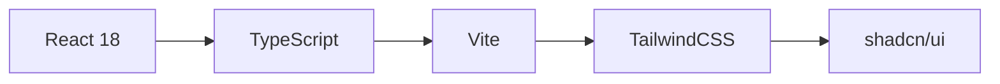
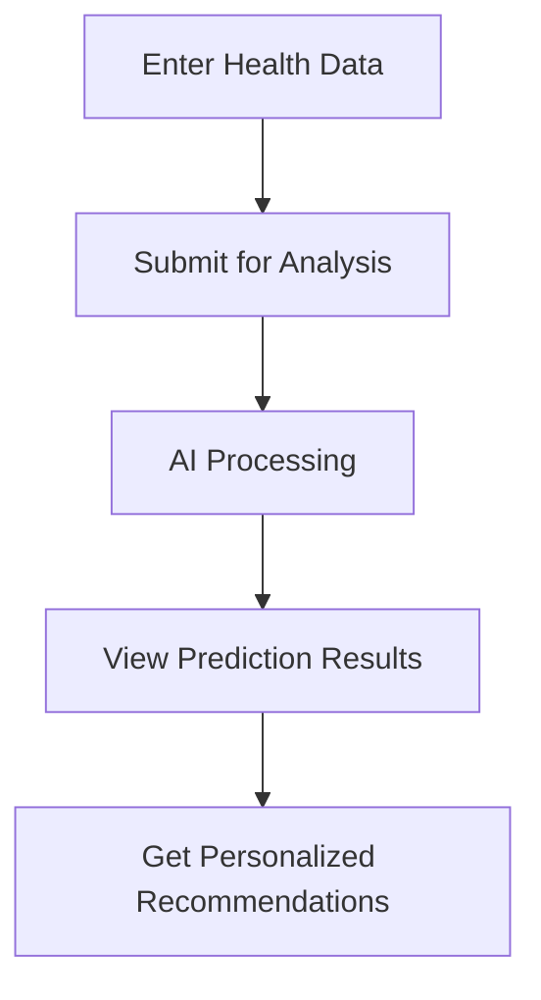

<div align="center">

# 🌙 SleepWell Predictor

### AI-Powered Sleep Disorder Prediction System

[](https://www.typescriptlang.org/)
[](https://reactjs.org/)
[](https://www.python.org/)
[](https://vitejs.dev/)
[](https://tailwindcss.com/)

**An intelligent web application that leverages machine learning to predict sleep disorders based on comprehensive health and lifestyle metrics.**

[Demo](#-demo) • [Features](#-key-features) • [Installation](#-quick-start) • [Documentation](#-documentation)

---

</div>

## 📖 Table of Contents

- [Overview](#-overview)
- [Key Features](#-key-features)
- [Tech Stack](#-tech-stack)
- [Quick Start](#-quick-start)
- [Project Structure](#-project-structure)
- [Usage Guide](#-usage-guide)
- [Configuration](#-configuration)
- [API Documentation](#-api-documentation)
- [Contributing](#-contributing)
- [Team](#-team)
- [License](#-license)

## 🎯 Overview

**SleepWell Predictor** is an advanced machine learning-powered web application developed as part of the Artificial Intelligence curriculum at BINUS University. The system analyzes various health parameters and lifestyle factors to accurately predict potential sleep disorders.

### Predictable Conditions

The application provides predictions for three primary sleep disorder categories:

| Condition                | Description                          | Indicators                             |
| ------------------------ | ------------------------------------ | -------------------------------------- |
| 🟢 **No Sleep Disorder** | Healthy sleep patterns detected      | Good sleep quality, balanced metrics   |
| 🟡 **Insomnia**          | Difficulty falling or staying asleep | Poor sleep quality, high stress levels |
| 🔴 **Sleep Apnea**       | Breathing interruptions during sleep | High BMI, elevated blood pressure      |

## ✨ Key Features

<table>
<tr>
<td width="50%">

### 🔮 Machine Learning Core

- Advanced AI algorithms for accurate predictions
- Multi-class classification model
- Confidence scoring for each diagnosis
- Trained on comprehensive health datasets

### 📊 Data Visualization

- Interactive probability charts
- Real-time result displays
- Confidence level indicators
- Visual health metric summaries

</td>
<td width="50%">

### 💡 Smart Recommendations

- Personalized health suggestions
- Condition-specific advice
- Lifestyle improvement tips
- Evidence-based recommendations

### 🎨 User Experience

- Modern, intuitive interface
- Fully responsive design
- Smooth animations & transitions
- Accessible for all users

</td>
</tr>
</table>

## 🏗️ Tech Stack

### Frontend Architecture



| Category               | Technologies                   |
| ---------------------- | ------------------------------ |
| **Core Framework**     | React 18.3, TypeScript 5.8     |
| **Build Tool**         | Vite 5.4                       |
| **Styling**            | TailwindCSS 3.4, PostCSS       |
| **UI Components**      | shadcn/ui, Radix UI            |
| **Form Management**    | React Hook Form 7.61, Zod 3.25 |
| **Routing**            | React Router 6.30              |
| **State Management**   | TanStack Query 5.83            |
| **Data Visualization** | Recharts 2.15                  |
| **Icons**              | Lucide React 0.462             |

### Backend Infrastructure

| Component           | Technology                        |
| ------------------- | --------------------------------- |
| **API Framework**   | Python FastAPI                    |
| **ML Engine**       | Scikit-learn                      |
| **Data Processing** | Pandas, NumPy                     |
| **Model**           | Random Forest / Gradient Boosting |

## 🚀 Quick Start

### 📋 Prerequisites

Ensure you have the following installed on your system:

| Requirement | Version | Download                            |
| ----------- | ------- | ----------------------------------- |
| Node.js     | v18.0+  | [Download](https://nodejs.org/)     |
| npm/bun     | Latest  | Included with Node.js               |
| Python      | 3.8+    | [Download](https://www.python.org/) |

### 🔧 Installation

#### Step 1: Clone the Repository

```bash
git clone <YOUR_GIT_URL>
cd sleep-well-predictor
```

#### Step 2: Install Dependencies

Choose your preferred package manager:

<details>
<summary><b>Using npm</b></summary>

```bash
npm install
```

</details>

<details>
<summary><b>Using bun</b> (Recommended for faster installation)</summary>

```bash
bun install
```

</details>

#### Step 3: Environment Setup

Create a `.env` file in the root directory:

```env
VITE_API_URL=http://localhost:8000
```

#### Step 4: Start Development Server

```bash
npm run dev
# or
bun dev
```

#### Step 5: Access Application

🌐 Open your browser and navigate to:

```
http://localhost:5173
```

### 📦 Build Commands

| Command           | Description                              |
| ----------------- | ---------------------------------------- |
| `npm run dev`     | Start development server with hot reload |
| `npm run build`   | Build for production (output: `dist/`)   |
| `npm run preview` | Preview production build locally         |
| `npm run lint`    | Run ESLint for code quality checks       |

## 📁 Project Structure

```
sleep-well-predictor/
├── src/
│   ├── components/          # React components
│   │   ├── ui/             # UI components (shadcn/ui)
│   │   ├── Header.tsx      # Navigation header
│   │   ├── Hero.tsx        # Hero section
│   │   ├── PredictionForm.tsx    # Data input form
│   │   └── PredictionResult.tsx  # Prediction results
│   ├── pages/              # Application pages
│   │   ├── Index.tsx       # Main page
│   │   └── NotFound.tsx    # 404 page
│   ├── types/              # TypeScript types
│   │   └── prediction.ts   # Types for predictions
│   ├── data/               # Static data
│   │   └── recommendations.ts  # Recommendation data
│   ├── hooks/              # Custom hooks
│   ├── lib/                # Utility functions
│   └── App.tsx             # Root component
├── public/                 # Static assets
└── package.json           # Dependencies & scripts
```

## 📱 Usage Guide

### Step-by-Step Process



#### 1️⃣ Data Input

Complete the comprehensive health assessment form:

- **👤 Personal Information**: Age, gender, occupation
- **😴 Sleep Metrics**: Duration, quality ratings
- **💪 Activity Levels**: Physical activity, daily steps
- **🧠 Mental Health**: Stress levels
- **🏥 Health Vitals**: Blood pressure, heart rate, BMI category

#### 2️⃣ Analysis

Click the **"Analyze Now"** button to process your data through our ML model.

#### 3️⃣ Results

Receive comprehensive analysis including:

- ✅ **Primary Diagnosis**: Sleep disorder classification
- 📊 **Confidence Scores**: Probability distribution for each condition
- 💡 **Health Insights**: Personalized recommendations
- 📈 **Improvement Tips**: Actionable lifestyle suggestions

## ⚙️ Configuration

### API Proxy Setup

Configure the API endpoint in `vite.config.ts`:

```typescript
import { defineConfig } from "vite";

export default defineConfig({
	server: {
		proxy: {
			"/api": {
				target: "http://localhost:8000",
				changeOrigin: true,
				rewrite: (path) => path.replace(/^\/api/, ""),
			},
		},
	},
});
```

### Environment Variables

Create `.env` file in project root:

```bash
# API Configuration
VITE_API_URL=http://localhost:8000

# Optional: Enable debug mode
VITE_DEBUG=false
```

## 📊 API Documentation

### Input Parameters

| Parameter                 | Type    | Range/Options             | Description                         |
| ------------------------- | ------- | ------------------------- | ----------------------------------- |
| `Age`                     | Integer | 18-100                    | Patient's age in years              |
| `Gender`                  | String  | Male, Female              | Biological gender                   |
| `Occupation`              | String  | Any                       | Current occupation/profession       |
| `Sleep_Duration`          | Float   | 4.0-12.0                  | Average sleep hours per night       |
| `Quality_of_Sleep`        | Integer | 1-10                      | Self-rated sleep quality score      |
| `Physical_Activity_Level` | Integer | 1-10                      | Daily activity intensity            |
| `Stress_Level`            | Integer | 1-10                      | Self-reported stress level          |
| `Blood_Pressure`          | String  | "XXX/YYY"                 | Systolic/Diastolic (e.g., "120/80") |
| `Heart_Rate`              | Integer | 40-120                    | Resting heart rate (BPM)            |
| `Daily_Steps`             | Integer | 0-30000                   | Average daily step count            |
| `BMI_Category`            | String  | Normal, Overweight, Obese | Body Mass Index classification      |

### API Request Example

```json
{
	"Age": 30,
	"Gender": "Male",
	"Occupation": "Software Engineer",
	"Sleep_Duration": 7.5,
	"Quality_of_Sleep": 8,
	"Physical_Activity_Level": 7,
	"Stress_Level": 6,
	"Blood_Pressure": "120/80",
	"Heart_Rate": 72,
	"Daily_Steps": 8000,
	"BMI_Category": "Normal"
}
```

### API Response Example

```json
{
	"prediction": "No Sleep Disorder",
	"confidence": 87.5,
	"probabilities": {
		"No Sleep Disorder": 0.875,
		"Insomnia": 0.095,
		"Sleep Apnea": 0.03
	}
}
```

## 🧪 Testing

```bash
# Run linting
npm run lint
```

## 📦 Dependencies

### Main Dependencies

- `react` & `react-dom` - Core React library
- `react-router-dom` - Routing
- `react-hook-form` - Form management
- `zod` - Schema validation
- `@tanstack/react-query` - Data fetching
- `tailwindcss` - Utility-first CSS
- `lucide-react` - Icon library
- `recharts` - Charting library

### UI Components

- `@radix-ui/*` - Accessible UI primitives
- `shadcn/ui` - Re-usable components

## 🤝 Contributing

While this is an academic project, we welcome contributions and feedback!

### How to Contribute

1. 🍴 Fork the repository
2. 🌿 Create a feature branch (`git checkout -b feature/AmazingFeature`)
3. 💾 Commit your changes (`git commit -m 'Add some AmazingFeature'`)
4. 📤 Push to the branch (`git push origin feature/AmazingFeature`)
5. 🔄 Open a Pull Request

### Code Quality Standards

- ✅ Follow TypeScript best practices
- ✅ Write meaningful commit messages
- ✅ Ensure all tests pass
- ✅ Update documentation as needed

**© 2025 SleepWell Predictor**

_Empowering healthier sleep through AI technology_

[⬆ Back to Top](#-sleepwell-predictor)

</div>
